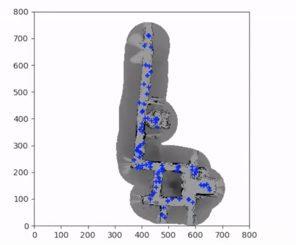

# Monte Carlo Localization of Wean Hall
-In cooperation with Mosam Dhabi and Sara Misra

**What is Monte Carlo Localization?**

Monte Carlo Localization (MCL), is a popular localization algorithm and known to be an effective application of particle filter
for mobile robot localization. 

**Demo**

